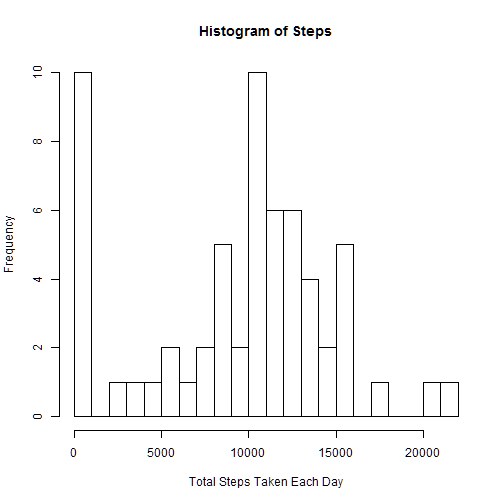
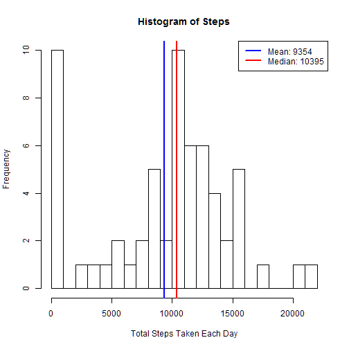
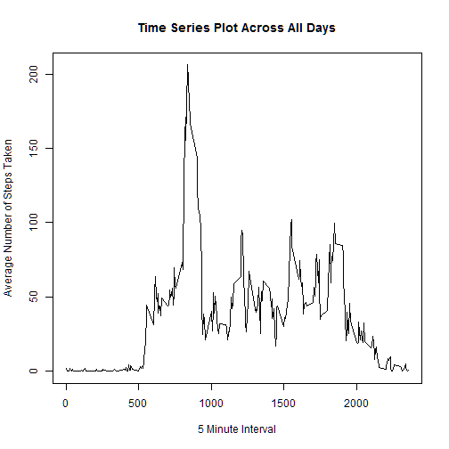
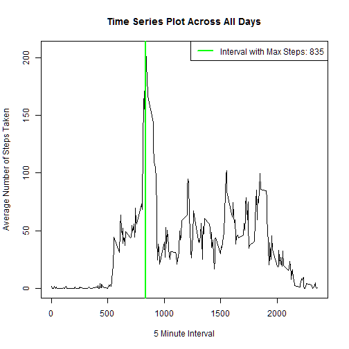
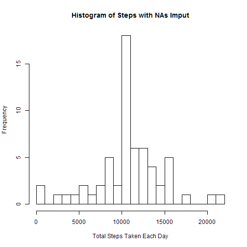
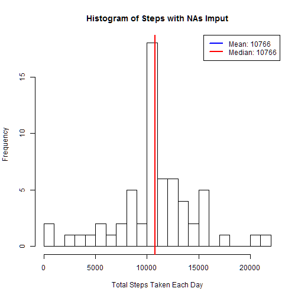
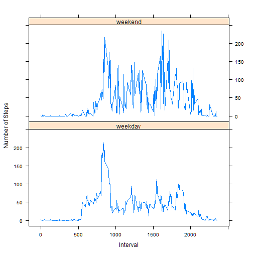

This is the R Markdown file for Coursera Reproducible Research Assignment 1

## Loading and preprocessing the data

Preprocessing consists of converting the $date variable to a date format 
and the $steps variable to a numeric format


```r
activityDF <- read.csv("activity.csv")

activityDF$date <- as.Date(activityDF$date)
activityDF$steps <- as.numeric(activityDF$steps)
```

## What is mean total number of steps taken per day?

I am using the plyr package to calculate the sum 
and collapse the dataframe accordingly
In order to deal with Missing Values, na.rm is set to TRUE, 
which means that NA values are treated as 0.


```r
# install.packages("plyr")
library(plyr)

stepsDF <- ddply(activityDF, .(date), 
               summarize, 
               steps = sum(steps, na.rm=TRUE))
```

### Make a histogram of the total number of steps taken each day


```r
hist(stepsDF$steps, breaks = 25, 
     main = "Histogram of Steps", 
     xlab = "Total Steps Taken Each Day")
```

 

### Calculate and report the mean and median of the total number of steps taken per day
Using the abline function, I am adding the mean value as a blue line
and the median value as a red line to the histogram as follows:
Note that for display purposes I have rounded the mean value of steps on the legend
   

```r
hist(stepsDF$steps, breaks = 25, 
     main = "Histogram of Steps", 
     xlab = "Total Steps Taken Each Day")

TSMean <- mean(stepsDF$steps)
abline(v = TSMean,
       col = "blue",
       lwd = 2)

TSMedian <- median(stepsDF$steps)
abline(v = TSMedian,
       col = "red",
       lwd = 2)

legend(x = "topright", 
       c(paste("Mean:", round(TSMean), sep = " "), paste("Median:", TSMedian, sep = " ")),
       col = c("blue", "red"),
       lwd = c(2, 2))
```

 


## What is the average daily activity pattern?

### Make a time series plot (i.e. type = "l") of the (x-axis) 5-minute interval and the (y-axis) average number of steps taken, averaged across all days 


```r
averageStepsPerIntervalDF <- ddply(activityDF, .(interval), 
                           summarize, 
                           steps = mean(steps, na.rm=TRUE))

plot(averageStepsPerIntervalDF,
     type = "l",
     main = "Time Series Plot Across All Days",
     xlab = "5 Minute Interval",
     ylab = "Average Number of Steps Taken")
```

 

### Which 5-minute interval, on average across all the days in the dataset,contains the maximum number of steps?
I calculate this interval and then identify it on the plot as follows:


```r
maxSteps <- with(averageStepsPerIntervalDF, max(steps))
result <- averageStepsPerIntervalDF[(averageStepsPerIntervalDF$steps == maxSteps),]
maxActivityInterval <- result$interval

plot(averageStepsPerIntervalDF,
     type = "l",
     main = "Time Series Plot Across All Days",
     xlab = "5 Minute Interval",
     ylab = "Average Number of Steps Taken")

abline(v = maxActivityInterval,
       col = "green",
       lwd = 2)

legend(x = "topright", 
       paste("Interval with Max Steps:", maxActivityInterval, sep = " "),
       col = "green",
       lwd = 2)
```

 

## Imputing missing values

### Calculate and report the total number of missing values in the dataset (i.e. the total number of rows with NAs)


```r
missingValues <- sum(is.na(activityDF))
paste("The Total Number of Missing Values is", missingValues, sep = " ")
```

```
## [1] "The Total Number of Missing Values is 2304"
```

### Devise a strategy for filling in all of the missing values in the dataset.
My strategy is to replace the missing values with the mean value for that
interval as calculated above in averageStepsPerIntervalDF
### Create a new dataset that is equal to the original dataset but with the missing data filled in.
First merge the original dataset with this one based on the intervals and  then replace the NA values in the original steps column with the relevent
mean value


```r
mergeDF <- merge(activityDF, averageStepsPerIntervalDF, by = c("interval"))

mergeDF$steps.x[is.na(mergeDF$steps.x)] <- mergeDF$steps.y[is.na(mergeDF$steps.x)]
```

### Make a histogram of the total number of steps taken each day


```r
mergeStepsDF <- ddply(mergeDF, .(date), 
                 summarize, 
                 steps = sum(steps.x), na.rm=TRUE)

hist(mergeStepsDF$steps, breaks = 25, 
     main = "Histogram of Steps with NAs Imput",
     xlab = "Total Steps Taken Each Day")
```

 

### Calculate and report the mean and median total number of steps taken per day.
Note that again I have rounded the values for display purposes while 
keeping the original numbers for calculations
Also, the mean and median are the same so the lines overlap on the plot!
This is due to the fact that my initial treatment of NAs was to translate
them to 0 and then I replaced the NAs with the mean value for that 
interval. This results in the same value for mean and median.


```r
hist(mergeStepsDF$steps, breaks = 25, 
     main = "Histogram of Steps with NAs Imput",
     xlab = "Total Steps Taken Each Day")

abline(v = mean(mergeStepsDF$steps),
       col = "blue",
       lwd = 2)

abline(v = median(mergeStepsDF$steps),
       col = "red",
       lwd = 2)

legend(x = "topright", 
       c(paste("Mean:", round(mean(mergeStepsDF$steps)), sep = " "), paste("Median:", round(median(mergeStepsDF$steps)), sep = " ")),
       col = c("blue", "red"),
       lwd = c(2, 2))
```

 

### Do these values differ from the estimates from the first part of the assignment? 
Yes. The first part of the Assignment reports the mean as 9354 and median as 10396. They are both 10766 now.

### What is the impact of imputing missing data on the estimates of the total daily number of steps?
The impact of this can be clearly seen when the 2 plots are compared. On the initial plot the first bin was large due to the fact that NA values were treated as 0. When these values were reassigned to the mean value for their respective intervals the frequency of the bins around the mean increased and the frequecy of the first bin reduced significantly.


## Are there differences in activity patterns between weekdays and weekends?

### Create a new factor variable in the dataset with two levels - "weekday" and "weekend" indicating whether a given date is a weekday or weekend day.
It is possible to use the weekdays() function as the $date column
has already been coerced with as.date


```r
mergeDF$dayOfWeek <- factor(weekdays(mergeDF$date) == c("Saturday",
                                                   "Sunday"))
levels(mergeDF$dayOfWeek)[levels(mergeDF$dayOfWeek)=="TRUE"] <- "weekend"
levels(mergeDF$dayOfWeek)[levels(mergeDF$dayOfWeek)=="FALSE"] <- "weekday"
```

### Make a panel plot containing a time series plot (i.e. type = "l") of the (x-axis) 5-minute interval and the (y-axis) average number of steps taken, averaged across all weekday days or weekend days.


```r
panelDF <- ddply(mergeDF, .(interval,dayOfWeek),
                 summarize,
                 steps = mean(steps.x, na.rm=TRUE))

# install.packages("lattice")
library(lattice)

xyplot(steps ~ interval | dayOfWeek, 
            data = panelDF, 
            layout = c(1,2),
            type = "l",
            xlab="Interval",
            ylab = "Number of Steps")
```

 
